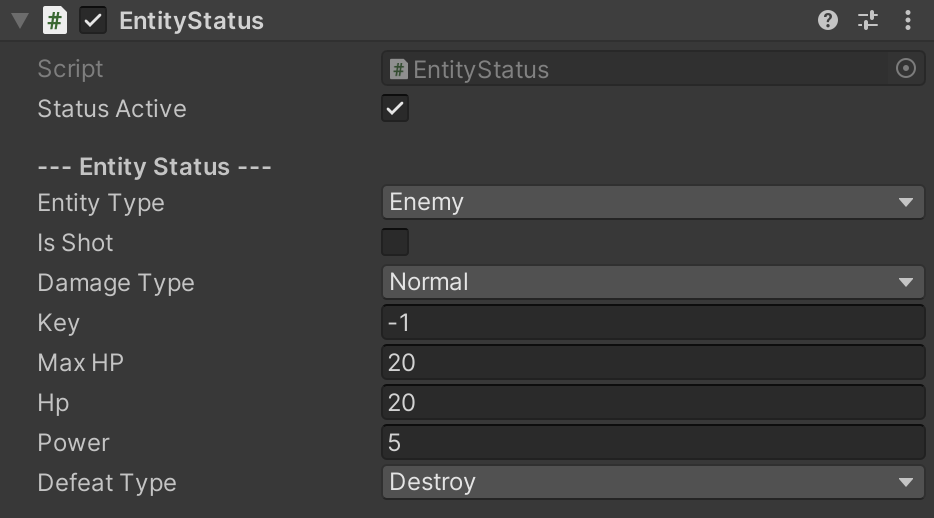

[EntityStatusExはこちら](/README_EntityStatusEx.md/)

# EntityStatus

GameObjectにHPと攻撃力を付与し、それらのステータスを管理する。
Entity同士が接触した時に自動的に相互にダメージを与える。

<!--# DEMO

-->


# Requirement

* UnityEngine
* System

# Usage

① EntityStatus.cs を任意のGameObjectにコンポーネントして、Tagに「Entity」を追加\
② RigidBodyとColliderをコンポーネント\
③ EntityStatusのパラメータを調整

※「Entity」タグが追加されていれば、Start()時に自動的にタグが変更されます。\
※ RigidBodyのisTriggerはtrueでもfalseでも問題なく動作します。

demo/EntityStatus_hyper.csは[HyperNova](https://kuritaro1122.github.io/HyperNova-Web/)で使用しているステータス管理プログラムです。EntityStatusを継承することで簡単にダメージエフェクトを追加したり、撃破スコアを追加したりできます。

# Contains

## Inspector



## Public Variable
```
bool statusActive
DamageType damageType
EntityType EntityType_ { get; }
float MaxHP { get; }
float HP { get; }
float Power { get; }
bool Defeated { get; }
```
## Public Function
```
EntityStatus Set(float? hp, float? power, EntityType? entityType, bool? isShot, DamageType? damageType)
EntityStatus SetDamagedAction(System.Action action, bool reset = false)
EntityStatus SetDefeatedAction(System.Action action, bool reset = false)
EntityStatus SetRecoverdAction(System.Action action, bool reset = false)
void Damage(float value, int key = -1)
void Recover(float value)
void RecoverFull(bool recoverAction = true)
void Defeat()
```

## Protected Variable
```
EntityType entityType
bool isShot
float maxHP
float hp
float power
```

## Virtual Funtion
```
void Awake()
void OnEnable()
void OnValidate()
void OnTriggerEnter(Collider other)
void OnCollisionEnter(Collision collision)
void Damage(float value, int key = -1)
void Recover(float value)
void RecoverFull(bool recoverAction = true)
void Defeat()
```

## Enum
```
EntityType { enemy, friend, obstacle }
DefeatType { destroy, nonActive, none }
```

# Note

このリポジトリを使用する際にはdemoフォルダを削除してください。EntityStatus_hyper.csは単体では動作しません。

# License

"EntityStatus" is under [MIT license](https://en.wikipedia.org/wiki/MIT_License).
